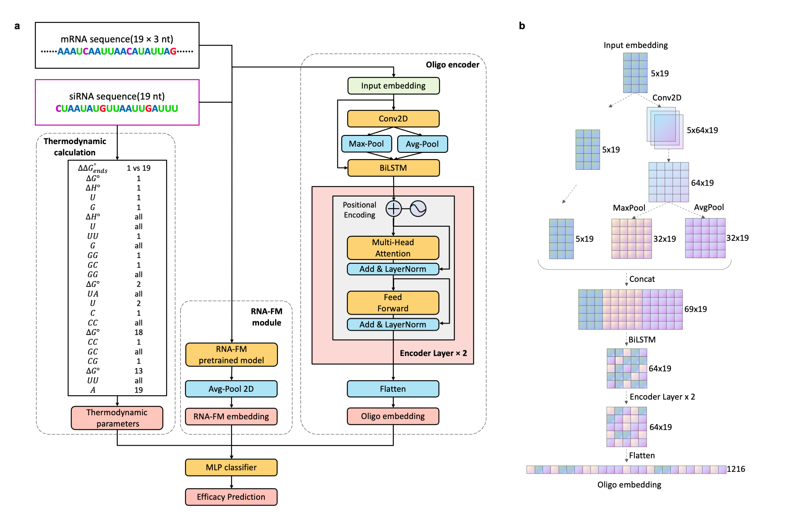

# OligoFormer

[](https://www.python.org/) 

Gene silencing through RNA interference (RNAi) has emerged as a powerful tool for studying gene function and developing therapeutics[1]. Small interfering RNA (siRNA) molecules play a crucial role in RNAi by targeting specific mRNA sequences for degradation. Identifying highly efficient siRNA molecules is essential for successful gene silencing experiments and therapeutic applications. Built on the transformer architecture[2],  OligoFormer can capture multi-dimensional features and learn complex patterns of siRNA-mRNA interactions for siRNA efficacy prediction.

## Datasets

OligoFormer was trained on a dataset of mRNA and siRNA pairs with experimentally measured efficacy by Huesken et al[4]. The training data consisted of diverse mRNA sequences and corresponding siRNA molecules with known efficacies.

| dataset                                                      | siRNA number | cell  line              | additional  info                          |
| ------------------------------------------------------------ | ------------ | ----------------------- | ----------------------------------------- |
| [Huesken](https://www.nature.com/articles/nbt1118)           | 2431         | H1299                   | Human  NCI-H1299 cells obtained from ATCC |
| [Reynolds](https://www.nature.com/articles/nbt936)           | 240          | HEK293                  | HEK293  or HEK293-Luc cells               |
| [Vickers](https://www.jbc.org/article/S0021-9258(19)32641-9/fulltext) | 76           | T24                     | ATCC,  Manassas,  VA                      |
| [Haborth](https://www.liebertpub.com/doi/10.1089/108729003321629638) | 44           | HeLa                    |                                           |
| [Takayuki](https://academic.oup.com/nar/article/35/4/e27/1079934) | 702          | HeLa                    | HeLa  cells stably expressing Hyg/EGFP    |
| [Ui-](https://academic.oup.com/nar/article/32/3/936/2904484?login=false)[Tei](https://academic.oup.com/nar/article/32/3/936/2904484?login=false) | 62           | CHO-K1,  HeLa,  E14TG2a |                                           |
| [Khvorova](https://www.nature.com/articles/nbt936)           | 14           | HEK293                  |                                           |
| [Hiesh](https://academic.oup.com/nar/article/32/3/893/2904476) | 108          | HEK293T                 |                                           |
| [Amarzguioui](https://pubmed.ncbi.nlm.nih.gov/12527766/)     | 46           | Cos-1,  HaCaT           |                                           |

## Model



## Installation

### Dependency

```bash
git clone https://github.com/byl18/OligoFormer.git #Clone the OligoFormer repository from GitHub
pip install -r requirements.txt #Install the required dependencies
```

1.Clone the repo

```git clone https://github.com/lulab/OligoFormer.git```

2.Create conda environment

```conda env create --name oligoformer --file=environment.yml```

### Usage

```python
# unrealized
import OligoFormer #Import the OligoFormer module
model = OligoFormer.Model() #Initialize the OligoFormer model
mRNA_sequence = "AUGCUACGAUUGCGACUUUGU"
candidate_siRNAs = model.design_siRNA(mRNA_sequence) #Design siRNA molecules
efficacies = model.predict_efficacy(candidate_siRNAs) #Predict siRNA efficacy
best_siRNA = max(candidate_siRNAs, key=efficacies.get) #Retrieve the siRNA with the highest predicted efficacy
```

OligoFormer also provides a CLI for easy access to siRNA design and efficacy prediction. Here's an example of how to use it:

```bash
python script/main.py --datasets ['Hu','Sha'] --output_dir output_dir --new_model True --batch_size 512 --epoch 300 --weight_decay 0.9999 --early_stopping 10 #default params
```


## Limitations

- The size of training dataset is limited and more siRNA datasets may improve this model further.
- Different datasets have strong batch effects due to different experimental conditions. So it may not perform optimally on mRNA sequences that significantly differ from the training data.


## References

[1] [Zamore, Phillip D., et al. "RNAi: double-stranded RNA directs the ATP-dependent cleavage of mRNA at 21 to 23 nucleotide intervals." *cell* 101.1 (2000): 25-33.](https://www.sciencedirect.com/science/article/pii/S0092867400806200)

[2] [Vaswani, Ashish, et al. "Attention is all you need." *Advances in neural information processing systems* 30 (2017).](https://proceedings.neurips.cc/paper/2017/file/3f5ee243547dee91fbd053c1c4a845aa-Paper.pdf)

[3] [Zhao, Weihao, et al. "POSTAR3: an updated platform for exploring post-transcriptional regulation coordinated by RNA-binding proteins." *Nucleic Acids Research* 50.D1 (2022): D287-D294.](https://academic.oup.com/nar/article/50/D1/D287/6353804)

[4] [Huesken, D., Lange, J., Mickanin, C. *et al.* Design of a genome-wide siRNA library using an artificial neural network. *Nat Biotechnol* **23**, 995–1001 (2005).](https://www.nature.com/articles/nbt1118#Abs1)

